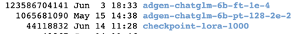

# ChatGLM-6B-lora

#改动说明

1 本仓库在ChatGLM-6B模型的基础上添加了lora微调。

2 对部分核心代码进行逐行注释和讲解 

3 lora实例部分做了个新闻短标题的生成

##相关介绍链接
https://blog.csdn.net/qjzcy/article/details/131206691?spm=1001.2014.3001.5502
https://blog.csdn.net/qjzcy/article/details/131092884?spm=1001.2014.3001.5502

### 例子
#### 示例1
* Input: 类型#上衣\*材质#牛仔布\*颜色#白色\*风格#简约\*图案#刺绣\*衣样式#外套\*衣款式#破洞
* Label: 简约而不简单的牛仔外套,白色的衣身十分百搭。衣身多处有做旧破洞设计,打破单调乏味,增加一丝造型看点。衣身后背处有趣味刺绣装饰,丰富层次感,彰显别样时尚。
* Output[微调前]: 这件上衣的材质是牛仔布,颜色是白色,风格是简约,图案是刺绣,衣样式是外套,衣款式是破洞。
* Output[微调后]: 这是一款简约的牛仔外套,破洞设计,将牛仔布破洞,带来一种随意与个性。破洞的牛仔外套,展现出时尚气息,带来一种休闲感。同时,刺绣图案,让整件外套更加立体。


### 不同finetune方法生成参数模型大小对比结果



## 使用方法


### 训练


##### P-tuning v2

```
bash train.sh
```

##### Finetune

```
bash ds_train_finetune.sh
```

##### LoRA


```
python finetune_lora_chatglm.py
```


## 模型部署
首先载入Tokenizer：

```python
from transformers import AutoConfig, AutoModel, AutoTokenizer

# 载入Tokenizer
tokenizer = AutoTokenizer.from_pretrained("THUDM/chatglm-6b", trust_remote_code=True)
```

1. 如果需要加载的是新 Checkpoint（只包含 PrefixEncoder 参数）：

```python
config = AutoConfig.from_pretrained("THUDM/chatglm-6b", trust_remote_code=True, pre_seq_len=128)
model = AutoModel.from_pretrained("THUDM/chatglm-6b", config=config, trust_remote_code=True)
prefix_state_dict = torch.load(os.path.join(CHECKPOINT_PATH, "pytorch_model.bin"))
new_prefix_state_dict = {}
for k, v in prefix_state_dict.items():
    if k.startswith("transformer.prefix_encoder."):
        new_prefix_state_dict[k[len("transformer.prefix_encoder."):]] = v
model.transformer.prefix_encoder.load_state_dict(new_prefix_state_dict)
```
注意你可能需要将 `pre_seq_len` 改成你训练时的实际值。如果你是[从本地加载模型](https://github.com/THUDM/ChatGLM-6B#%E4%BB%8E%E6%9C%AC%E5%9C%B0%E5%8A%A0%E8%BD%BD%E6%A8%A1%E5%9E%8B)的话，需要将 `THUDM/chatglm-6b` 改成本地的模型路径（注意不是checkpoint路径）。

2. 如果需要加载的是旧 Checkpoint（包含 ChatGLM-6B 以及 PrefixEncoder 参数），或者进行的是全参数微调，则直接加载整个 Checkpoint：

```python
model = AutoModel.from_pretrained(CHECKPOINT_PATH, trust_remote_code=True)
```

之后根据需求可以进行量化，也可以直接使用：

```python
# Comment out the following line if you don't use quantization
model = model.quantize(4)
model = model.half().cuda()
model.transformer.prefix_encoder.float()
model = model.eval()

response, history = model.chat(tokenizer, "你好", history=[])
```

**[23/04/19]** 你也可以直接运行支持加载 P-Tuning v2 checkpoint 的 [web demo](web_demo.py)
```shell
bash web_demo.sh
```
可能需要修改 [web_demo.sh](web_demo.sh) 的内容以符合你实际的 checkpoint 情况。

## 使用自己的数据集
修改 `train.sh` 和 `evaluate.sh` 中的 `train_file`、`validation_file`和`test_file`为你自己的 JSON 格式数据集路径，并将 `prompt_column` 和 `response_column` 改为 JSON 文件中输入文本和输出文本对应的 KEY。可能还需要增大 `max_source_length` 和 `max_target_length` 来匹配你自己的数据集中的最大输入输出长度。


