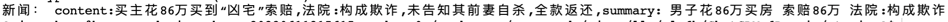
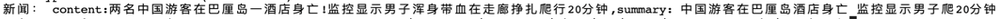
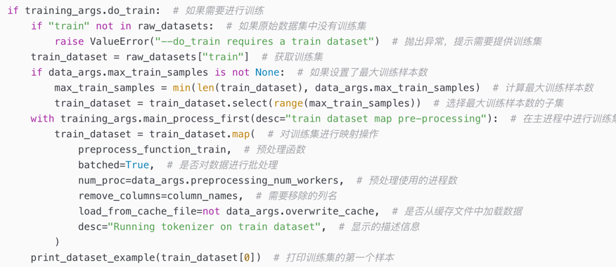
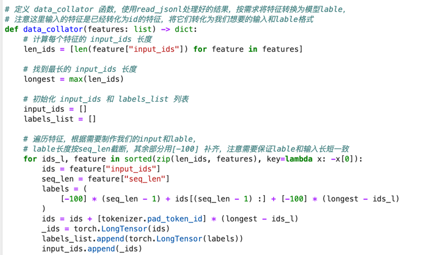

# ChatGLM-6B-RLHF

## 示例1







## 改动说明

1 本仓库在ChatGLM-6B模型的基础上添加了lora微调。 23.04.26

2 对主文件main.py核心代码进行逐行注释和说明 23.05.15

3 添加lora训练部分做了个新闻短标题的生成  23.06.2

4 对lora训练文件finetune_lora_chatglm.py核心代码进行逐行注释和说明 23.06.10

5 添加lora预测代码 23.06.17

6 添加rm预测模块 23.07.17

7 添加ppo预测模块 23.07.29


## 相关介绍链接

main.py核心代码进行逐行注释和说明
https://blog.csdn.net/qjzcy/article/details/131206691?spm=1001.2014.3001.5502


lora训练代码核心代码进行逐行注释和说明
https://blog.csdn.net/qjzcy/article/details/131092884?spm=1001.2014.3001.5502


### 不同finetune方法生成参数模型大小对比结果


## 使用方法

进入 ptuning 目录

cd ptuning

### 训练


##### P-tuning v2

```
bash train.sh
```

##### Finetune

```
bash ds_train_finetune.sh
```

##### LoRA


```
python finetune_lora_sft.py
```
##### RM


```
python finetune_lora_rm.py
```
##### PPO


```
注 
1。ppo 需要trl 版本0.4.0 可以使用命令安装 pip install trl==0.4.0
2。ppo代码需要加载两个模型，sft 和 rm， 所以显存需要大一些大不然会报显存不够的错误，本例在A100的机器上跑通

单卡命令
    python finetune_ppo.py
多gpu卡命令
    deepspeed finetune_ppo.py

```

### 预测


##### LoRA


```
python predict_lora_sft.py
```
##### RM


```
python predict_lora_rm.py
```

## 模型部署
首先载入Tokenizer：

```python
from transformers import AutoConfig, AutoModel, AutoTokenizer

# 载入Tokenizer
tokenizer = AutoTokenizer.from_pretrained("THUDM/chatglm-6b", trust_remote_code=True)
```

1. 如果需要加载的是新 Checkpoint（只包含 PrefixEncoder 参数）：

```python
config = AutoConfig.from_pretrained("THUDM/chatglm-6b", trust_remote_code=True, pre_seq_len=128)
model = AutoModel.from_pretrained("THUDM/chatglm-6b", config=config, trust_remote_code=True)
prefix_state_dict = torch.load(os.path.join(CHECKPOINT_PATH, "pytorch_model.bin"))
new_prefix_state_dict = {}
for k, v in prefix_state_dict.items():
    if k.startswith("transformer.prefix_encoder."):
        new_prefix_state_dict[k[len("transformer.prefix_encoder."):]] = v
model.transformer.prefix_encoder.load_state_dict(new_prefix_state_dict)
```
注意你可能需要将 `pre_seq_len` 改成你训练时的实际值。如果你是[从本地加载模型](https://github.com/THUDM/ChatGLM-6B#%E4%BB%8E%E6%9C%AC%E5%9C%B0%E5%8A%A0%E8%BD%BD%E6%A8%A1%E5%9E%8B)的话，需要将 `THUDM/chatglm-6b` 改成本地的模型路径（注意不是checkpoint路径）。

2. 如果需要加载的是旧 Checkpoint（包含 ChatGLM-6B 以及 PrefixEncoder 参数），或者进行的是全参数微调，则直接加载整个 Checkpoint：

```python
model = AutoModel.from_pretrained(CHECKPOINT_PATH, trust_remote_code=True)
```

之后根据需求可以进行量化，也可以直接使用：

```python
# Comment out the following line if you don't use quantization
model = model.quantize(4)
model = model.half().cuda()
model.transformer.prefix_encoder.float()
model = model.eval()

response, history = model.chat(tokenizer, "你好", history=[])
```

**[23/04/19]** 你也可以直接运行支持加载 P-Tuning v2 checkpoint 的 [web demo](web_demo.py)
```shell
bash web_demo.sh
```
可能需要修改 [web_demo.sh](web_demo.sh) 的内容以符合你实际的 checkpoint 情况。

##Contact
If you find our work useful, please do not save your star!

If you have any questions, please email 136037396@qq.com


